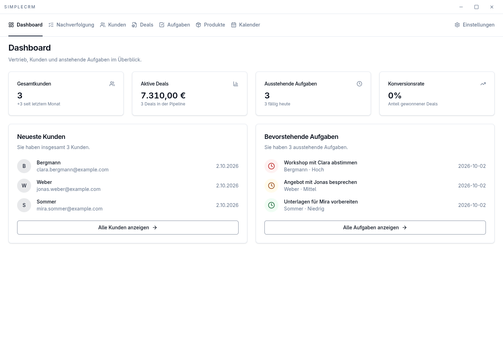

# SimpleCRM

SimpleCRM is a desktop CRM for customers, products, deals, tasks, and appointments.
It stores your records in a local SQLite database. An optional connection imports
customer and product data from JTL through MSSQL.



The screenshot uses fictional data in a separate test database.

## What you can do

- Keep customer records, notes, and custom fields.
- Manage deals in a table or Kanban board and link products to them.
- Schedule customer tasks and appointments in the calendar.
- Review follow-up work, record activities, and snooze tasks.
- Import JTL data and configure daily email reminders.
- Choose a light, dark, or system theme.

## Install

Download the installer for your platform from
[GitHub Releases](https://github.com/bl4ckh4nd/SimpleCRMPublic/releases).

Available builds are Windows x64, macOS x64 and arm64, and Linux x64.
The binaries are unsigned, so your operating system may show a trust warning.

## Run from source

Use Node.js 22 and pnpm 9.15.9. Native dependencies need a C/C++ build toolchain.
On Linux, install the development headers for libsecret.

```bash
git clone https://github.com/bl4ckh4nd/SimpleCRMPublic.git
cd SimpleCRMPublic
corepack enable
pnpm install
pnpm run electron:dev
```

The install step downloads Electron, patches better-sqlite3, and rebuilds the
native modules. The development command starts Vite and Electron with hot reload.

To run the production build locally:

```bash
pnpm run build
pnpm run electron:start
```

To create an installer without publishing it:

```bash
pnpm run electron:build
```

## Configuration and data

Set up MSSQL and email reminders in the app's Settings.
MSSQL and SMTP passwords use the operating system keychain through Keytar.
SQLite data, logs, and non-secret settings live in Electron's platform-specific
userData directory.

JTL synchronization imports data into the desktop database. It does not replace
SQLite with a remote service. The desktop app does not require a SaaS account.

## Development checks

```bash
pnpm run release:test
pnpm run lint
pnpm test -- --runInBand
pnpm run typecheck
pnpm run test:e2e
```

The Electron end-to-end tests use isolated databases and need no configured
MSSQL server. The settings tests exercise failed connection attempts.
On headless Linux, run the last command with `xvfb-run -a`.

## Runtime

The React renderer calls Electron through the validated endpoints in
`shared/ipc/channels.ts` and the preload allowlist. Electron main owns SQLite,
MSSQL access, notifications, synchronization, and database transactions.

The renderer cannot access Node.js or the database directly.
See the [ownership decision](docs/adr/0001-main-process-ownership.md),
[IPC decision](docs/adr/0002-endpoint-based-ipc-contract.md), and
[UI conventions](docs/design-system.md).

## Releases

Run the GitHub Release workflow on main and choose patch, minor, or major.
The workflow bumps the version, runs the checks, builds each platform, and
publishes a tag and GitHub Release with SHA-256 checksums and updater metadata.

Choose current to resume publication of the version already tagged at that
commit. Do not bump package.json separately before starting the workflow.

## Repository boundary

This public repository owns the Electron desktop app.
SaaS authentication, tenant state, billing, deployment configuration, and
customer-specific settings belong in the private downstream repository.

Do not commit credentials, real customer data, SQLite databases, or .env files.
